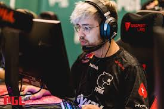
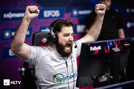
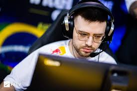
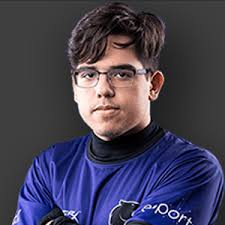

# FURIA GG - Jogadores Principais

Projeto web que apresenta os principais jogadores da equipe FURIA de CS:GO. Cada jogador possui uma página de documentário dedicada e um chatbot interativo com respostas personalizadas. O design é moderno e responsivo, com foco na experiência do usuário.

## 🧭 Índice

- [📌 Sobre o Projeto](#sobre-o-projeto)
- [🖼️ Demonstrações](#demonstrações)
- [💻 Tecnologias Utilizadas](#tecnologias-utilizadas)
- [📦 Estrutura de Arquivos](#estrutura-de-arquivos)
- [⚙️ Como Executar Localmente](#como-executar-localmente)
- [🙋 Contribuição](#contribuição)
- [📄 Licença](#licença)

---

## 📌 Sobre o Projeto

O projeto tem como objetivo homenagear e destacar os principais jogadores da FURIA: **FalleN, arT, KSCERATO e yuurih**. Cada jogador conta com:

- 📘 Uma página de documentário com sua história no cenário de CS:GO.
- 🤖 Um chatbot com falas personalizadas.
- 🎨 Estilo único de cores e layout por jogador.

---

## 🖼️ Demonstrações

### Página Inicial

Interface com os 4 jogadores e acesso aos seus documentários e chats:

![Página Inicial]

### Página de Documentário (arT)

Detalhes sobre a trajetória do jogador:

### Chatbot Interativo (arT)

Bate-papo com o jogador de forma personalizada:

---

### Página de Documentário (FalleN)

Detalhes sobre a trajetória do jogador:

### Chatbot Interativo (FalleN)

Bate-papo com o jogador de forma personalizada:

---

### Página de Documentário (KSCERATO)

Detalhes sobre a trajetória do jogador:

### Chatbot Interativo (KSCERATO)

Bate-papo com o jogador de forma personalizada:

---

### Página de Documentário (yuurih)

Detalhes sobre a trajetória do jogador:

### Chatbot Interativo (yuurih)

Bate-papo com o jogador de forma personalizada:

---

## 💻 Tecnologias Utilizadas

- **HTML5**: Estruturação e conteúdo das páginas.
- **CSS3**: Estilo e layout, com foco em design responsivo.
- **JavaScript**: Interatividade dos chatbots, com respostas dinâmicas baseadas em cada jogador.
- **VS Code**: Editor de código utilizado para o desenvolvimento do projeto.
- **Live Server**: Extensão para visualização em tempo real durante o desenvolvimento.

---

## 📦 Estrutura de Arquivos

A estrutura do projeto é organizada da seguinte maneira:

