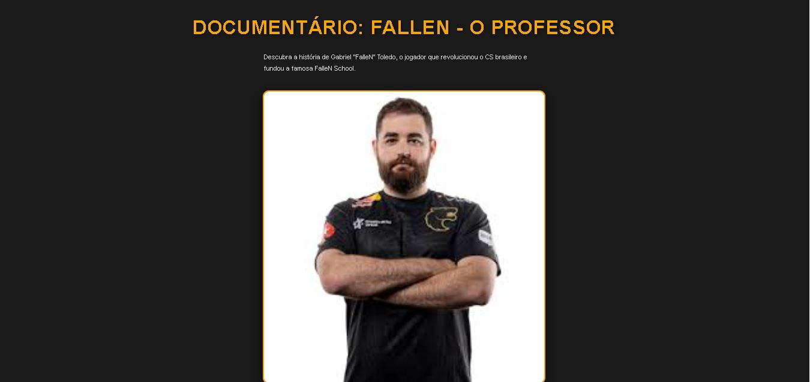
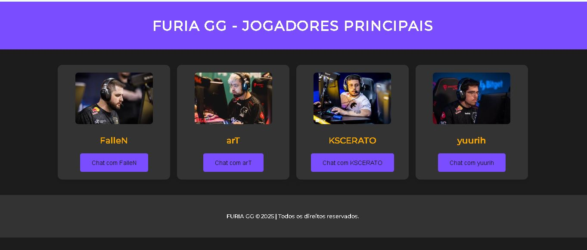
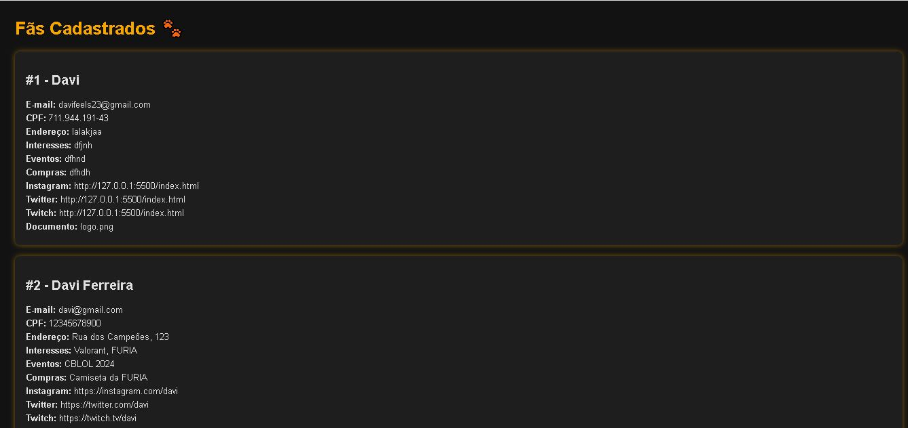
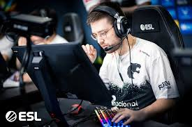

# FURIA GG - Jogadores Principais

Projeto web que apresenta os principais jogadores da equipe FURIA de CS:GO. Cada jogador possui uma página de documentário dedicada e um chatbot interativo com respostas personalizadas. O design é moderno e responsivo, com foco na experiência do usuário.


## Imagens

### Doc Fallen


### Players


### Tela De Cadastro



## 🧭 Índice

- [📌 Sobre o Projeto](#-sobre-o-projeto)
- [🖼️ Demonstrações](#-demonstrações)
- [💻 Tecnologias Utilizadas](#-tecnologias-utilizadas)
- [📦 Estrutura de Arquivos](#-estrutura-de-arquivos)
- [⚙️ Como Executar Localmente](#-como-executar-localmente)
- [🙋 Contribuição](#-contribuição)
- [📄 Licença](#-licença)

---

## 📌 Sobre o Projeto

O projeto tem como objetivo homenagear e destacar os principais jogadores da FURIA: **FalleN, arT, KSCERATO e yuurih**. Cada jogador conta com:

- 📘 Uma página de documentário com sua história no cenário de CS:GO.
- 🤖 Um chatbot com falas personalizadas.
- 🎨 Estilo único de cores e layout por jogador.

---

## 🖼️ Demonstrações

### Página Inicial
Interface com os 4 jogadores e acesso aos seus documentários e chats:


---

### Página de Documentário (arT)
Detalhes sobre a trajetória do jogador:



### Chatbot Interativo (arT)
Bate-papo com o jogador de forma personalizada:


---

### Página de Documentário (FalleN)
Detalhes sobre a trajetória do jogador:


### Chatbot Interativo (FalleN)
Bate-papo com o jogador de forma personalizada:


---

### Página de Documentário (KSCERATO)
Detalhes sobre a trajetória do jogador:


### Chatbot Interativo (KSCERATO)
Bate-papo com o jogador de forma personalizada:


---

### Página de Documentário (yuurih)
Detalhes sobre a trajetória do jogador:


### Chatbot Interativo (yuurih)
Bate-papo com o jogador de forma personalizada:


---

## 💻 Tecnologias Utilizadas

- **HTML5**: Estruturação e conteúdo das páginas.
- **CSS3**: Estilo e layout, com foco em design responsivo.
- **JavaScript**: Interatividade dos chatbots, com respostas dinâmicas baseadas em cada jogador.
- **VS Code**: Editor de código utilizado para o desenvolvimento do projeto.
- **Live Server**: Extensão para visualização em tempo real durante o desenvolvimento.

---

## 📦 Estrutura de Arquivos

A estrutura do projeto é organizada da seguinte maneira:

furia-connect-man/
├── assets/                   # Imagens, vídeos e mídias em geral
│   └── (todas as imagens .jpg)

├── css/                      # Todos os arquivos de estilo (CSS)
│   ├── players/              # Estilos específicos dos jogadores
│   │   ├── 1.css
│   │   ├── 2.css
│   │   ├── 3.css
│   │   └── 4.css
│   ├── bot.css               # Estilo dos chatbots
│   └── styles.css            # Estilo geral do site

├── js/                       # Scripts JavaScript
│   └── bot.js                # Lógica dos chatbots

├── pages/                    # Páginas HTML
│   ├── chatbots/             # Chatbots individuais
│   │   ├── chatbot_art.html
│   │   ├── chatbot_fallen.html
│   │   ├── chatbot_kscerato.html
│   │   └── chatbot_yuurih.html
│   ├── docs/                 # Documentários dos jogadores
│   │   ├── doc_art.html
│   │   ├── doc_fallen.html
│   │   ├── doc_kscerato.html
│   │   └── doc_yuurih.html
│   └── index.html            # Página inicial

├── README.md                 # Documentação do projeto
├── package-lock.json         # Gerenciado de dependências (Node.js)

---

## ⚙️ Como Executar Localmente

1. Clone o repositório:
   ```bash
   git clone https://github.com/davifeels/furia-connect.git


